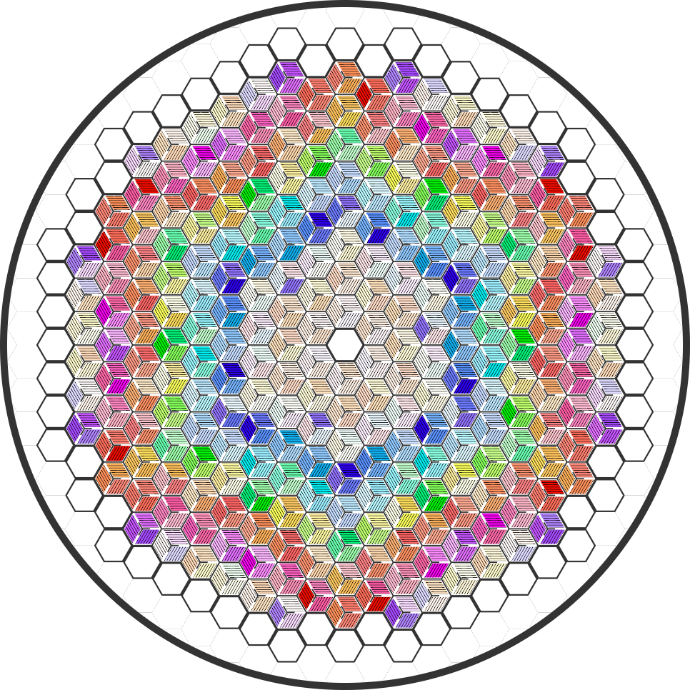

# FHR-input
Generate a SCALE input file for a full-core FHR model with segmented fuel stripes in any arbitrary dimension with symmetric depletion zones.

In order to deplete different regions of the complicated FHR assembly, each region has to be defined by a separate material in the compositions block of the scale input file. Then each portion of the geometry that would like to be depleted separately (whether by plank, stripe, axial, or assembly) must be uniquely defined in the geometry. So the input files become very complicated quickly since they cannot be easily repeated without copying and replacing all of the identifiers. I though this would be safer to do in a python script to keep track of bookkeeping as well as make it more flexible if different partitions of the model would like to be depleted.

1) First, I divided an FHR core input file in Scale into important units in separate files each named something like input.assembly.inp .

2) Next, I created a scale_unit_class in scale_input.py that can read these files including the media, holes, arrays, and geometry features. The scale untis can then be printed while replacing media identifiers or array identifiers. By doing this units and array can essentially be copied as long as the descriptors and unit numbers are kept unique.

3) Lastly, the script is ran through core_depletion_zones.py which has a class named core_class that keeps track of breaking down the unit files into a full-core model. The full-core class is simultaneasouly instantiated and saves the output file using:

core_class(output="full-core.inp", tritants=3, planks=1, stripes=1, sections=1, axials=2)

Here each assembly would be depleted by each 3rd of the assembly (tritants=3) and divided into 2 axial regions (axials=2). 
